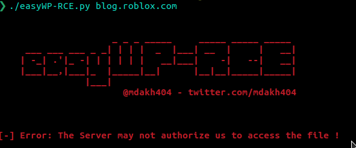

# easyWP-RCE
a simple script created to find an easy RCE on WordPress based sites, some WordPress sites still have the install.php file inside the wp-admin directory, if you're lucky with it and you find an install button, you should be able to escalate it to an RCE, after taking over the admin account, you will be able to upload a malicious plugin that gives you a remote shell on the target machine.

## Installation

```bash
user@machine:~$ git clone https://github.com/mdakh404/easyWP-RCE.git
user@machine:~$ cd easyWP-RCE && chmod +x easyWP-RCE.py
```

- **NOTE**: requests,bs4 and termcolor must be installed.

## Usage:

```bash
user@machine:~$ ./easyWP-RCE.py target-wp.com
```



## Automation:
Right ! you have a list of detected-WordPress-based sites and you need to find that easy RCE, with bash, everything is easier than before :)

```bash
user@machine:~$ for site in wp-sites; do python3 easyWP-RCE.py $site; done
```

## Contributing
Did you find another way to achieve an easy RCE in WordPress based sites ? you're welcome to contribute to this small script and add your own logic in it, thanks for sharing !
